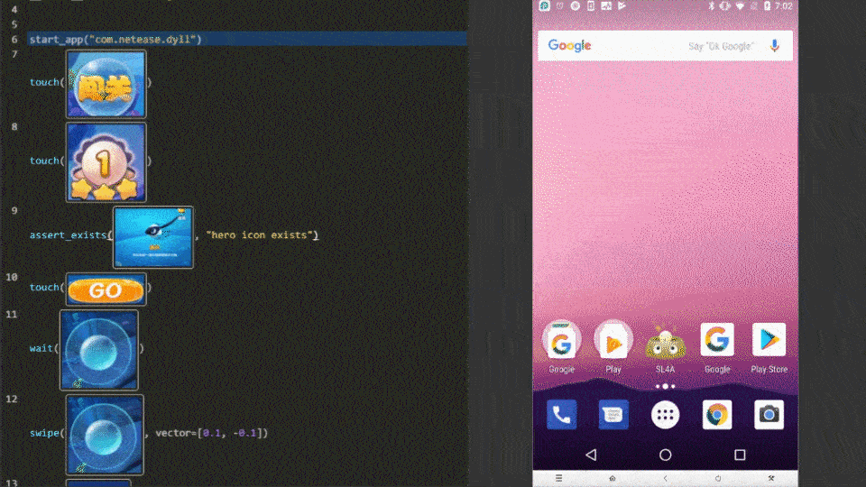

# Airtest &middot; [](https://travis-ci.org/AirtestProject/Airtest)

**Cross-Platform UI Automation Framework for Games and Apps**

**跨平台的UI自动化框架，适用于游戏和App** （[中文版点这里](./README_zh.md)）





## Features

*   **Write Once, Run Anywhere:** Airtest provides cross-platform APIs, including app installation, simulated input, assertion and so forth. Airtest uses image recognition technology to locate UI elements so that you can automate games and apps without injecting any code. 

*   **Fully Scalable:** Airtest cases can be easily run on large device farms, using commandline or python API. HTML reports with detailed info and screen recording allow you to quickly locate failure points. NetEase builds [Airlab](https://airlab.163.com/) on top of the Airtest Project.

*   **AirtestIDE:** AirtestIDE is an out of the box GUI tool that helps to create and run cases in a user-friendly way. AirtestIDE supports a complete automation workflow: ``create -> run -> report``.

*   **Poco:** [Poco](https://github.com/AirtestProject/Poco) adds the ability to directly access object(UI widget) hierarchy across the major platforms and game engines. It allows writing instructions in Python, to achieve more advanced automation.

Get started from [airtest homepage](http://airtest.netease.com/)

#### [Supported Platforms](./docs/wiki/device/platforms.md)


## Installation

Use `pip` to install the Airtest python library. 

```Shell
pip install -U airtest
```

On MacOS/Linux platform, you need to grant adb execute permission.

```Shell
# for mac
cd {your_python_path}/site-packages/airtest/core/android/static/adb/mac
# for linux
# cd {your_python_path}/site-packages/airtest/core/android/static/adb/linux
chmod +x adb
```

Download AirtestIDE from our [homepage](http://airtest.netease.com/) if you need to use the GUI tool.


## Documentation

You can find the complete Airtest documentation on [readthedocs](http://airtest.readthedocs.io/).


## Examples

Airtest aims at providing platform-independent API so that you can write automated cases once and run it on multiple devices and platforms.

1. Using [connect_device](http://airtest.readthedocs.io/en/latest/README_MORE.html#connect-device) API you can connect to any android/iOS device or windows application.
1. Then perform [simulated input](http://airtest.readthedocs.io/en/latest/README_MORE.html#simulate-input) to automate your game or app.
1. **DO NOT** forget to [make assertions](http://airtest.readthedocs.io/en/latest/README_MORE.html#make-assertion) of the expected result. 

```Python
from airtest.core.api import *

# connect an android phone with adb
init_device("Android")
# or use connect_device api
# connect_device("Android:///")

install("path/to/your/apk")
start_app("package_name_of_your_apk")
touch(Template("image_of_a_button.png"))
swipe(Template("slide_start.png"), Template("slide_end.png"))
assert_exists(Template("success.png"))
keyevent("BACK")
home()
uninstall("package_name_of_your_apk")
```

For more detailed info, please refer to [Airtest Python API reference](http://airtest.readthedocs.io/en/latest/all_module/airtest.core.api.html) or take a look at [API code](./airtest/core/api.py)


## Running ``.air`` cases from CLI

Using AirtestIDE, you can easily create automated cases as ``.air`` directories.
Airtest CLI provides the possibility to execute cases on different host machines and target device platforms without using AirtestIDE itself.

```Shell
# run cases targeting on Android phone connected to your host machine via ADB
airtest run "path to your .air dir" --device Android:///

# run cases targeting on Windows application whose title matches Unity.*
airtest run "path to your .air dir" --device "Windows:///?title_re=Unity.*"

# generate HTML report after running cases
airtest report "path to your .air dir"

# or use as a python module
python -m airtest run "path to your .air dir" --device Android:///
```

Try running provided example case: [``airtest/playground/test_blackjack.air``](./playground/test_blackjack.air) and see [Usage of CLI](http://airtest.readthedocs.io/en/latest/README_MORE.html#running-air-from-cli). Here is a [multi-device runner sample](https://github.com/AirtestProject/multi-device-runner).


## Contribution

Pull requests are very welcome. 


## Thanks

Thanks for all these great works that make this project better.

- [stf](https://github.com/openstf)
- [atx](https://github.com/NetEaseGame/ATX)
- [pywinauto](https://github.com/pywinauto/pywinauto)
