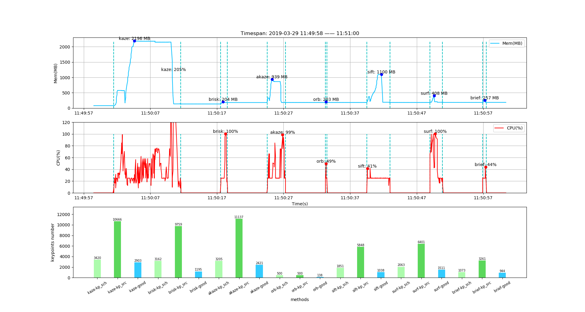
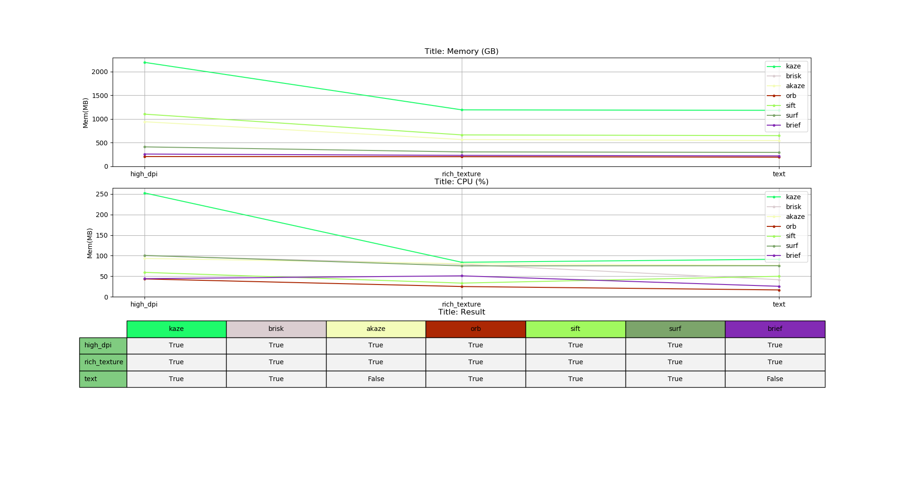

# Airtest - benchmark

[中文版文档](README_cn.md)

**Benchmark comparison of Various Image Recognition AlgorithmsImage Recognition Algorithms.** 


## I. Introduction
	
  There are different kinds of image recognition algorithms integrated into the airtest framework.
  Including template matching and image recognition methods based on feature points extracting.

### ① Purpose of this repository:
 
 - Analyze the performance of different key-point matching methods;
 - Provide the basis for selecting the image matching methods in the airtest scripts.

### ② Image Matching Methods:
 - Template matching
	 - Not applicable for cross-resolution matching;
	 - There will always be a result;
	 - name: `"tpl"`
 - Key-point mathing
	 - Suitable for cross-resolution recognition;
	 - Maybe no matching results
	 - names: `["kaze", "brisk", "akaze", "orb", "sift", "surf", "brief"]`

### ③ How to set matching methods in Airtest scripts:
```python
from airtest.core.settings import Settings as ST
# image matching will follow the method list, until the result is found or timeout:
ST.CVSTRATEGY = ["surf", "tpl"]
```


## II. Run test

 - Install running environment: `pip install -r requirements.txt`
 - Run test script: `python benchmark.py`


## III. Result

In `benchmark.py`:

### ① Performance comparison of different methods for a single image:
```python
method_list = ["kaze", "brisk", "akaze", "orb", "sift", "surf", "brief"]
# Draw the CPU and mem profile curve of the image matching. Big image [2907, 1403]  Small image [1079, 804]
search_file, screen_file = "sample\\high_dpi\\tpl1551940579340.png", "sample\\high_dpi\\tpl1551944272194.png"
dir_path, file_name = "result", "high_dpi.json"
test_and_profile_and_plot(search_file, screen_file, dir_path, file_name, method_list)
```


 - **Performance analysis:**
   - **Memory:**
	   - The top picture is the memory curve;
	   - Memory usage: `kaze > sift > akaze > surf > brief > brisk > orb`.
   - **CPU:**
	   - The middle picture is the CPU curve;
	   - CPU useage: `kaze > surf > akaze > brisk > sift > brief > orb`.
   - **Time useage:**
	   - The horizontal axis is time(s), and the program log has the `run time` output;
	   - runtime: `kaze > sift > akaze > surf > brisk > brief > orb`.
   - **Matched key-points number:**
	   - The bottom image shows the number of key-points;
	   - 'kp_sch' bar is the number of key-points of the search image;
	   - 'kp_src' bar is the number of key-points of the screen image;
	   - 'good' bar is the number of matched key-points
	   - key-point number: `kaze > akaze > surf > brisk > sift > brief > orb`

### ② Performance comparison of methods for different images

```python
method_list = ["kaze", "brisk", "akaze", "orb", "sift", "surf", "brief"]
# Test different images and write performance test data
test_and_profile_all_images(method_list)
# Draw the methods compare result of different images
plot_profiled_all_images_table(method_list)
```


 - **Performance analysis:**
   - **Maximum memory:**
	   - The top picture is the memory curve，The horizontal axis is image names;
	   - Max memory: `kaze > sift > akaze > surf > brief > brisk > orb`
   - **Maximum CPU:**
	   - The middle picture is the CPU curve;
	   - Max CPU: `kaze > surf > akaze > brisk > sift > brief > orb`
   - **Matching results:**
	   - `sift > surf > kaze > akaze > brisk > brief > orb`


## IV. Code structure

 - **profile_recorder.py**
	 - `CheckKeypointResult`: Perform key-point matching to check the results;
	 - `RecordThread`: Thread for recording CPU and memory;
	 - `ProfileRecorder`: Perform image matching, record performance data and write to file.

 - **plot.py**
	 - `PlotResult`: Draw the compare results of target images matching.

 - **benchmark.py**
	 - `profile_different_methods`: Perform performance compare process, and write to the specified file;
	 - `plot_one_image_result`: Draw performance data results graph for the specified image;
	 - `test_and_profile_all_images`: Perform matching on a specific images, record performance data and write to file;
	 - `plot_profiled_all_images_table`: Draw a comparison result chart based on the result of the image matching testing.
