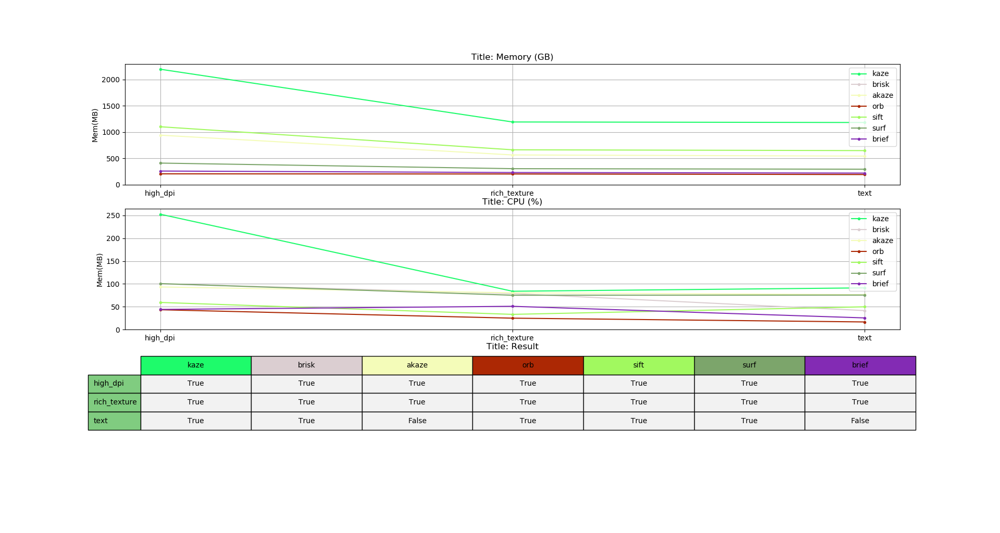

# Airtest - benchmark

[English document](README.md)

**多种图像识别算法的性能测试 & 算法优劣对比.** 

## 一、仓库介绍
	
  在airtest框架中集成了不同种类的图像识别算法。
  其中包括模板匹配、以及基于特征点的图像识别方法。

### 1、本仓库目的:
 
 - 展示不同的特征点匹配方法的性能优劣；
 - 提供airtest脚本中，图像识别方法的选择依据。

### 2、图像匹配方法的介绍：
 - 模板匹配：
	 - 无法跨分辨率识别
	 - 一定有相对最佳的匹配结果
	 - 方法名：`"tpl"`
 - 特征点匹配，
	 - 跨分辨率识别
	 - 不一定有匹配结果
	 - 方法名列表：`["kaze", "brisk", "akaze", "orb", "sift", "surf", "brief"]`

### 3、Airtest脚本图像匹配方法的设定方式：
```python
from airtest.core.settings import Settings as ST
# 脚本运行时将按照此算法顺序识别，直到“找到符合设定阈值的识别结果”或“识别超时”:
ST.CVSTRATEGY = ["surf", "tpl"]
```


## 二、运行方式

 - 安装环境： `pip install -r requirements.txt`
 - 运行脚本： `python benchmark.py`


## 三、结果说明

运行代码在`benchmark.py`中：

### 1、 针对单张图片，不同方法的性能对比：
```python
method_list = ["kaze", "brisk", "akaze", "orb", "sift", "surf", "brief"]
# 针对一张图片，绘制该张图片的CPU和内存使用情况.截屏[2907, 1403] 截图[1079, 804]
search_file, screen_file = "sample\\high_dpi\\tpl1551940579340.png", "sample\\high_dpi\\tpl1551944272194.png"
dir_path, file_name = "result", "high_dpi.json"
test_and_profile_and_plot(search_file, screen_file, dir_path, file_name, method_list)
```


 - **性能解析：**
   - **内存：**
	   - 最上方图为内存曲线
	   - 内存占用：kaze > sift > akaze > surf > brief > brisk > orb
   - **CPU：**
	   - 中间图为CPU曲线
	   - CPU占用：kaze > surf > akaze > brisk > sift > brief > orb
   - **时间：**
	   - 横轴为时间轴，且程序运行日志中有`run tume`输出
	   - 运行时长：kaze > sift > akaze > surf > brisk > brief > orb
   - **特征点对数量：**
	   - 最下方图为特征点数量图
	   - kp_sch为小图的特征点数量
	   - kp_src为大图的特征点数量
	   - good为匹配成功的特征点对数量
	   - 点对数量：kaze > akaze > surf > brisk > sift > brief > orb

### 2、针对多张图片的不同方法的性能对比

```python
method_list = ["kaze", "brisk", "akaze", "orb", "sift", "surf", "brief"]
# 测试多张图片，写入性能测试数据
test_and_profile_all_images(method_list)
# 对比绘制多张图片的结果
plot_profiled_all_images_table(method_list)
```


 - **性能解析：**
   - **最大内存：**
	   - 最上方图为内存曲线，横轴为不同的图片名
	   - 最大内存：kaze > sift > akaze > surf > brief > brisk > orb
   - **最大CPU：**
	   - 中间图为CPU曲线
	   - 最大CPU：kaze > surf > akaze > brisk > sift > brief > orb
   - **识别效果：**
	   - sift > surf > kaze > akaze > brisk > brief > orb


## 四、代码结构

 - **profile_recorder.py**
	 - `CheckKeypointResult`: 执行特征点识别,查看结果;
	 - `RecordThread`: 用于记录CPU和内存的线程;
	 - `ProfileRecorder`: 执行图像匹配，记录性能数据并写入文件.

 - **plot.py**
	 - `PlotResult`：绘制单张图片的方法对比结果.

 - **benchmark.py**
	 - `profile_different_methods`: 执行指定图片的图像识别，并写入指定文件;
	 - `plot_one_image_result`: 绘制指定图片的性能数据结果图;
	 - `test_and_profile_all_images`: 对特定的多张图片执行匹配，记录性能数据并写入文件;
	 - `plot_profiled_all_images_table`: 对多个图片的识别结果，绘制对比结果图.
