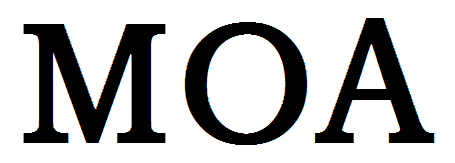

moa
======

moa是一个简单轻量级的python库，服务于手机自动化，为android手机量身定做，基于opencv图像识别技术来确定元素的位置。

借助它可以完成：自动发送微信消息，登陆验证。游戏行业，使用它可以完成自动打怪，自动打副本。更多的使用方法，需要发挥你的创意。

如果你是第一次接触moa，下面的这些文档可以帮助你更快的掌握它。
* :ref:`Quickstart guide <quickstart>` -- 快速入门包含了掌握该库必要的基础知识。需要花费5到10分钟来看完它。

Indices and tables
==================

* :ref:`genindex`
* :ref:`modindex`
* :ref:`search`
