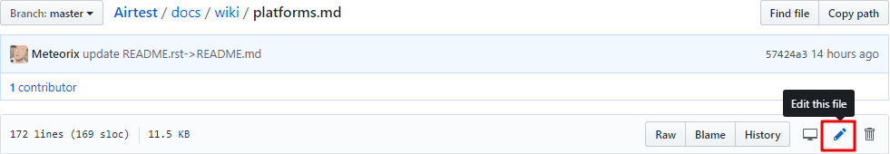
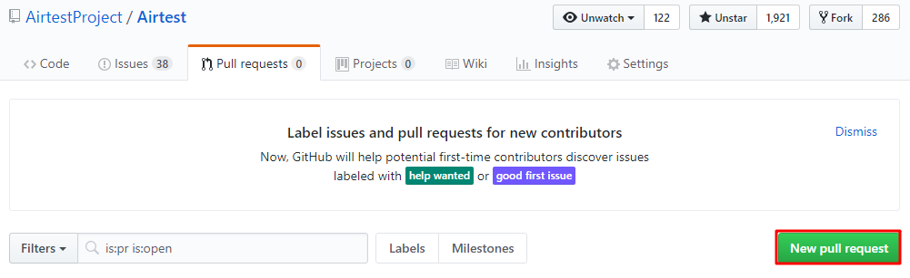

Supported Platforms
===================

## Overview


| Platforms                 | Airtest                        | Poco                                                                                                    |
|---------------------------|--------------------------------|---------------------------------------------------------------------------------------------------------|
| Android                   | √ [model list](#android)             | √                                                                                                       |
| Emulator                  | √ [model list](#android-emulator)    | √                                                                                                       |
| iOS                       | √ [model list](https://github.com/AirtestProject/iOS-Tagent) | [ios-tagent](https://github.com/AirtestProject/iOS-Tagent)                            |
| Windows                   | √                              | Not yet                                                                                                 | 
| Cocos2dx-js & Cocos2dx-lua| √                              | √ [integration doc](https://poco.readthedocs.io/en/latest/source/doc/integration.html#cocos2dx-lua)            |
| Unity3D                   | √                              | √ [integration doc](https://poco-chinese.readthedocs.io/en/latest/source/doc/integration.html#unity3d)         |
| Egret                     | √                              | √ [integration doc](https://github.com/AirtestProject/Poco-SDK/tree/master/Egret)                              |
| WeChat Applet & Webview   | √                              | √ [tutorial](http://airtest.netease.com/docs/cn/6_poco_framework/poco_webview.html)                     |
| Netease engines           | √                              | √ [tutorial](http://git-qa.gz.netease.com/maki/netease-ide-plugin)                                      |
| Other engines             | √                              | √ [implementation doc](https://poco-chinese.readthedocs.io/en/latest/source/doc/implementation_guide.html)        |


## iOS

以[iOS-Tagent](https://github.com/AirtestProject/iOS-Tagent)文档为准，如下版本完全支持：

|Xcode|iOS|
|-----|---|
|10|12|
|9|11|

其他版本的xcode和iOS未经完整测试，可能会出现非预期的错误情况。

## Android

*	由于Android设备类型特别多，此列表是部分已经验证过设备列表
*	[部分厂商设备需要特殊设置：小米、三星、华为、vivo、OPPO、魅族...](http://airtest.netease.com/docs/cn/2_device_connection/2_android_faq.html#id7)
*	如果你的设备不在此列表中，请点击右上角的`Edit this file`并发起[Pull Request](./platforms.md#pull-request-guide)


| 序号 | 测试机型                          | 兼容性 | 性能 | 备注 |
|------|----------------------------------|-------|------|------|
| 1    | 华为 荣耀 3C（H30-L01）           | 通过   | 低   |      |
| 2    | 华为 荣耀 4A（SCL-AL00）          | 通过   | 低   |      |
| 3    | 华为 荣耀 4C（CHM-TL00）          | 通过   | 低   |      |
| 4    | 华为 荣耀 6（H60-L01）            | 通过   | 低   |      |
| 5    | 华为 荣耀 6 Plus（PE-TL10）       | 通过   | 低   |      |
| 6    | 华为 荣耀 7（PLK-AL10）           | 通过   | 中   |      |
| 7    | 华为 荣耀 7i（ATH-AL00）          | 通过   | 低   |      |
| 8    | 华为 荣耀3X（畅玩版）（G750-T01） | 通过   | 低   |      |
| 9    | 华为 荣耀 畅玩4（G621-TL00）      | 通过   | 低   |      |
| 10   | 华为 荣耀 畅玩 4X（CHE-TL00H）    | 通过   | 低   |      |
| 11   | 华为 荣耀畅玩 4X（CHE1-CL20）     | 通过   | 低   |      |
| 12   | 华为 荣耀畅玩 5A（CAM-AL00）      | 通过   | 低   |      |
| 13   | 华为 荣耀畅玩 5X（KIW-AL10）      | 通过   | 低   |      |
| 14   | 华为 荣耀畅玩 5C（NEM-TL00H）     | 通过   | 中   |      |
| 15   | 华为 荣耀畅玩 6X（BLN-AL30）      | 通过   | 中   |      |
| 16   | 华为 畅享 5（TIT-AL00）           | 通过   | 低   |      |
| 17   | 华为 畅享 5S（TAG-AL00）          | 通过   | 低   |      |
| 18   | 华为 畅享 6S（DIG-AL00）          | 通过   | 低   |      |
| 19   | 华为 Mate 7（MT7-CL00）           | 通过   | 低   |      |
| 20   | 华为 nova（CAZ-TL10）             | 通过   | 中   |      |
| 21   | 华为 Mate S（CRR-UL00）           | 通过   | 中   |      |
| 22   | 华为 麦芒 6（RNE-AL00）           | 通过   | 中   |      |
| 23   | 华为 P7（P7-L07）                 | 通过   | 低   |      |
| 24   | 华为 P8 高配版（GRA-UL10）        | 通过   | 中   |      |
| 25   | 华为 P8（GRA-TL00/标准版）        | 通过   | 中   |      |
| 26   | 华为 G7 Plus（RIO-TL00）          | 通过   | 低   |      |
| 27   | 华为 G9 青春版（VNS-AL00）        | 通过   | 低   |      |
| 28   | 华为 P9（EVA-AL10）               | 通过   | 高   |      |
| 29   | 华为 P9 Plus（VIE-AL10）          | 通过   | 高   |      |
| 30   | 华为 P10（VTR-AL00）              | 通过   | 高   |      |
| 31   | 华为 Mate8（NXT-AL10）            | 通过   | 高   |      |
| 32   | 华为 Mate9（MHA-AL00）            | 通过   | 高   |      |
| 33   | 华为 Mate9 Pro（LON-AL00）        | 通过   | 高   |      |
| 34   | 华为 Mate10（ALP-AL00）           | 通过   | 高   |      |
| 35   | 华为 Mate10 Pro（BLA-AL00）       | 通过   | 高   |      |
| 36   | 华为 荣耀8（FRD-AL00）            | 通过   | 高   |      |
| 37   | 华为 荣耀9（STF-AL10）            | 通过   | 高   |      |
| 38   | 华为 荣耀V8（KNT-AL10）           | 通过   | 高   |      |
| 39   | 华为 荣耀V9（DUK-AL20）           | 通过   | 高   |      |
| 40   | 华为 荣耀V10（BKL-AL20）          | 通过   | 高   |      |
| 41   | 华为 nova2S（HWI-AL00）           | 通过   | 高   |      |
| 42   | 小米 2        | 通过   | 低   |      |
| 43   | 小米 2A       | 通过   | 低   |      |
| 44   | 小米 2S（标准版）                 | 通过   | 低   |      |
| 45   | 小米 3（联通版）                  | 通过   | 低   |      |
| 46   | 小米 3 移动版 | 通过   | 低   |      |
| 47   | 小米 4（移动版/低配版）           | 通过   | 中   |      |
| 48   | 小米 4C（标准版）                 | 通过   | 中   |      |
| 49   | 红米 1S 移动版| 通过   | 低   |      |
| 50   | 红米 1S（电信3G）                 | 通过   | 低   |      |
| 51   | 红米 2（增强版）                  | 通过   | 低   |      |
| 52   | 红米 2A       | 通过   | 低   |      |
| 53   | 红米 3        | 通过   | 低   |      |
| 54   | 红米 3X       | 通过   | 低   | HOME等模拟按键无效       |
| 55   | 红米 3S（高配版）                 | 通过   | 低   |      |
| 56   | 红米 4        | 通过   | 低   |      |
| 57   | 红米 4A       | 通过   | 低   |      |
| 58   | 红米 Note 标准版（移动4G）        | 通过   | 低   |      |
| 59   | 红米 Note 增强版（移动3G）        | 通过   | 低   |      |
| 60   | 红米 Note（增强版/联通4G）        | 通过   | 低   |      |
| 61   | 红米 Note 3 全网通（高配版）      | 通过   | 中   |      |
| 62   | 红米 Note 2 高配版（移动版）      | 通过   | 中   |      |
| 63   | 小米 Note（标准版）               | 通过   | 中   |      |
| 64   | 红米 Note 4X  | 通过   | 中   |      |
| 65   | 小米 Max      | 通过   | 中   |      |
| 66   | 小米 平板2    | 通过   | 中   |      |
| 67   | 红米 Note 2（移动版）             | 通过   | 中   |      |
| 68   | 红米 Note 4（高配版）             | 通过   | 中   |      |
| 69   | 小米 5C       | 通过   | 中   | HOME等模拟按键无效       |
| 70   | 红米 Note 3 双网通（高配版）      | 通过   | 中   |      |
| 71   | 小米 5（高配版）                  | 通过   | 高   |      |
| 72   | 小米 Note 顶配版                  | 通过   | 高   |      |
| 73   | 小米 Note 3（标准版）             | 通过   | 高   |      |
| 74   | 小米 5S（高配版）                 | 通过   | 高   |      |
| 75   | 小米 6        | 通过   | 高   |      |
| 76   | 小米 MIX      | 通过   | 高   |      |
| 77   | 小米 MIX 2    | 通过   | 高   |      |
| 78   | OPPO A31（移动版）                | 通过   | 低   |      |
| 79   | OPPO A33      | 通过   | 低   |      |
| 80   | OPPO A37      | 通过   | 低   |      |
| 81   | OPPO A53（全网通）                | 通过   | 低   |      |
| 82   | OPPO A57      | 通过   | 低   |      |
| 83   | OPPO A59      | 通过   | 低   |      |
| 84   | OPPO A59s     | 通过   | 低   |      |
| 85   | OPPO R7（移动版）                 | 通过   | 低   |      |
| 86   | OPPO R7s 移动4G                   | 通过   | 低   |      |
| 87   | OPPO R1C（R8207/移动版）          | 通过   | 低   |      |
| 88   | OPPO 1107（移动版）               | 通过   | 低   |      |
| 89   | OPPO R9s Plus | 通过   | 中   |      |
| 90   | OPPO R9 Plus（全网通）            | 通过   | 中   |      |
| 91   | OPPO R9s（R9s/全网通）            | 通过   | 中   |      |
| 92   | OPPO R9（R9m/全网通）             | 通过   | 中   |      |
| 93   | OPPO R11      | 通过   | 高   |      |
| 94   | OPPO R11 Plus | 通过   | 高   |      |
| 95   | OPPO R11s     | 通过   | 高   |      |
| 96   | OPPO R11s Plus| 通过   | 高   |      |
| 97   | vivo Y23L     | 通过   | 低   |      |
| 98   | vivo Y27      | 通过   | 低   |      |
| 99   | vivo Y31A     | 通过   | 低   |      |
| 100  | vivo Y33      | 通过   | 低   |      |
| 101  | vivo Y37      | 通过   | 低   |      |
| 102  | vivo V3       | 通过   | 低   |      |
| 103  | vivo Y51A     | 通过   | 低   |      |
| 104  | vivo Y55A     | 通过   | 低   | 模拟按键无效、text报错   |
| 105  | vivo Y66      | 通过   | 低   |      |
| 106  | vivo Y67      | 通过   | 低   | HOME等模拟按键无效       |
| 107  | vivo Xplay5（全网通）             | 通过   | 中   |      |
| 108  | vivo X6S（全网通）                | 通过   | 中   |      |
| 109  | vivo X7       | 通过   | 中   |      |
| 110  | vivo X7 Plus  | 通过   | 中   |      |
| 111  | vivo X9（X9i）| 通过   | 中   | HOME等模拟按键无效       |
| 112  | vivo X9 Plus  | 通过   | 中   |      |
| 113  | vivo X9s      | 通过   | 中   |      |
| 114  | vivo X9s Plus | 通过   | 中   |      |
| 115  | vivo Xplay5 旗舰版                | 通过   | 高   |      |
| 116  | vivo X20      | 通过   | 高   |      |
| 117  | vivo X20 Plus（屏幕指纹版）       | 通过   | 高   | HOME等模拟按键无效       |
| 118  | 三星 Galaxy S3（GT-I9300）        | 通过   | 低   |      |
| 119  | 三星 Galaxy S4（GT-I9507V）       | 通过   | 低   |      |
| 120  | 三星 GalaxyS4（GT-I9508V）        | 通过   | 低   |      |
| 121  | 三星 Galaxy A5 2016（SM-A5108）   | 通过   | 低   |      |
| 122  | 三星 Galaxy J7 2016（SM-J7108）   | 通过   | 低   |      |
| 123  | 三星 Galaxy A8（SM-A8000）        | 通过   | 低   |      |
| 124  | 三星 Galaxy Note 3（SM-N9002）    | 通过   | 低   |      |
| 125  | 三星 Galaxy A9（SM-A9000）        | 通过   | 中   |      |
| 126  | 三星 Galaxy Note 4（SM-N9109W）   | 通过   | 中   |      |
| 127  | 三星 Galaxy S5（SM-G9008W）       | 通过   | 中   | 勾选use ADB orientation  |
| 128  | 三星 Galaxy Note 5（SM-N9200）    | 通过   | 高   |      |
| 129  | 三星 Galaxy Note 8（SM-N9500）    | 通过   | 高   |      |
| 130  | 三星 Galaxy S6（SM-G9209）        | 通过   | 高   |      |
| 131  | 三星 Galaxy S6 Edge（SM-G9250）   | 通过   | 高   |      |
| 132  | 三星 Galaxy S7（SM-G9308）        | 通过   | 高   |      |
| 133  | 三星 Galaxy S7 Edge（SM-G9350）   | 通过   | 高   |      |
| 134  | 三星 Galaxy S8（SM-G9500）        | 通过   | 高   |      |
| 135  | 三星 Galaxy S8（SM-G9550）       | 通过   | 高   |      |
| 136  | 魅族 MX4（移动4G）                | 通过   | 低   |      |
| 137  | 魅族 魅蓝     | 通过   | 低   |      |
| 138  | 魅族 魅蓝 Note 2（M571C/电信4G）  | 通过   | 低   |      |
| 139  | 魅族 MX5（移动4G）                | 通过   | 中   |      |
| 140  | 魅族 MX6      | 通过   | 中   |      |
| 141  | 魅族 魅蓝 Note 3                  | 通过   | 中   |      |
| 142  | 魅族 魅蓝 Note 5                  | 通过   | 中   |      |
| 143  | 魅族 魅蓝 Note 6                  | 通过   | 中   |      |
| 144  | 魅族 Pro 7    | 通过   | 中   |      |
| 145  | 魅族 Pro 7 Plus                   | 通过   | 高   |      |
| 146  | 金立 F100S（全网通）              | 通过   | 低   |      |
| 147  | 金立 金钢GN5001S（全网通）        | 通过   | 低   |      |
| 148  | 金立 金钢2（GN5005）              | 通过   | 低   |      |
| 149  | 金立 F100（移动4G）               | 通过   | 低   |      |
| 150  | 金立 F103     | 通过   | 低   |      |
| 151  | 金立 M6（GN8003）                 | 通过   | 中   |      |
| 152  | 金立 S11      | 通过   | 中   |      |
| 153  | Moto MT887    | 通过   | 低   |      |
| 154  | Moto Z2 Play（XT1710-08）         | 通过   | 中   |      |
| 155  | 诺基亚 6（TA-1000/全网通）        | 通过   | 低   |      |
| 156  | 努比亚 Z11 mini（NX529J）         | 通过   | 低   |      |
| 157  | 酷派 大神 F2（8675-FHD）          | 通过   | 低   |      |
| 158  | 中国移动 A1（M623C）              | 通过   | 低   |      |
| 159  | 360奇酷 N4S（1505-A01）           | 通过   | 中   |      |
| 160  | 乐视 乐1s（X500）                 | 通过   | 中   |      |
| 161  | 乐视 乐2（X620）                  | 通过   | 中   |      |
| 162  | 一加 5（A5000）                   | 通过   | 高   |      |
| 163  | 锤子 坚果 Pro 2（OS105）          | 通过   | 高   |      |
| 164  | OPPO R15      | 通过   | 高   | 输入法不可用，poco不可用 |


## Android Emulator

下列模拟器都经过验证，[Android模拟器连接指引](http://airtest.netease.com/docs/cn/2_device_connection/3_emulator_connection.html)

*	[x] 夜神
*	[x] 网易Mumu
*	[x] 逍遥	
*	[x] iTools
*	[x] 天天	
*	[x] 海马玩
*	[x] BlueStacks
*	[x] AVD

## Pull Request Guide

*	由于市面上的设备类型特别多，希望大家可以共同维护这份列表
*	Airtest Team会定期整理这份列表，并尽力提高Airtest的兼容性

操作步骤：

1. 点击右上角的`Edit this file`

	

2. 在列表尾部增加一行，不管是否验证通过都可以加上去

	```
	| 165  | OPPO R20      | 通过     | 高   |  |
	| 166  | OPPO R21      | 不通过   | 高   |  |
	```


3. 发起[Pull Request](https://github.com/AirtestProject/Airtest/pulls)

	

4. Pull Request成功之后，你会成为Airtest项目的[Contributor](https://github.com/AirtestProject/Airtest/graphs/contributors)
